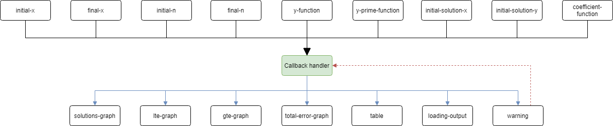

# Numerical methods

Numerical methods for ordinary differential equations are methods used to find numerical approximations to the solutions of ordinary differential equations (ODEs). Their use is also known as "numerical integration", although this term can also refer to the computation of integrals.

In this app we use:
* Euler
* Improved Euler
* Runge-Kutta

**Check [PDF report](https://github.com/AlekseyKorshuk/numerical-methods/blob/master/docs/report.pdf) for more details.**

# How to use
You can install and run from source with:
```bash
git clone https://github.com/AlekseyKorshuk/numerical-methods --recursive
cd numerical-methods
pip install -r requirements.txt
python main.py
```
Now visit [127.0.0.1:8050](http://127.0.0.1:8050). 

# Sample results

## Graphs

### Exact and numerical solutions


### Total approximation error depending on the number of grid cells


### Local truncation error


### Global truncation error


# UML diagram


# Toggle callback graph


